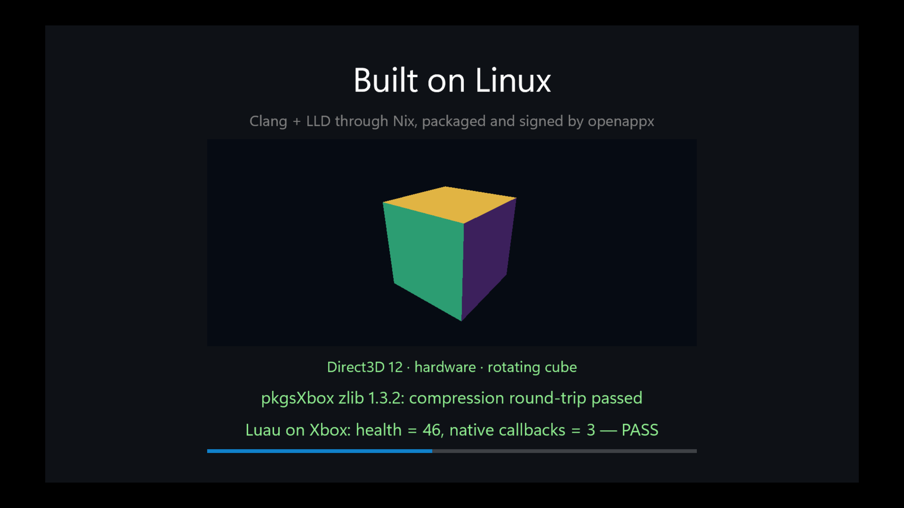
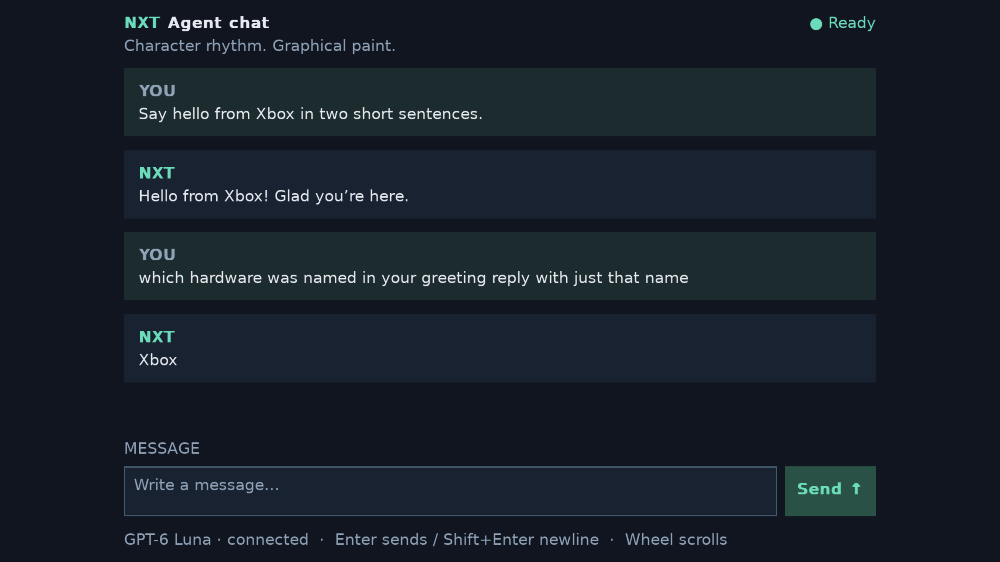

# nixbox

**Build Xbox UWP apps from Linux with Nix.**

nixbox brings together a pinned Windows SDK, Clang/LLD, and native packaging
and signing tools. Nix handles the downloads and setup; you write C++ and deploy
the result to an Xbox in Developer Mode.

The included app runs **Luau gameplay scripts on a real Xbox Series X**, calls
back into C++, checks a zlib compression round-trip, and renders a **rotating Direct3D 12 cube**
inside a XAML `SwapChainPanel`. Built with LLVM 23,
packaged and signed on Linux.



## Try it

You'll need:

- An **x86_64 Linux machine** with Nix and flakes enabled. An Apple silicon
  Mac works too, for everything except the steps that need Wine: the XAML
  sample (`hello`, whose `.idl` goes through `midlrt`) and the Visual Studio
  project route. On a Mac, start with the game: `nix build .#game` and
  `nix run .#deploy-game`.
- An Xbox with **Developer Mode enabled** and Device Portal reachable from your
  machine. Building the app doesn't require a console.

```sh
git clone https://github.com/mbrock/nixbox.git
cd nixbox

# Build the app and its MSIX package (nix build .#hello, plus the optional cache).
./build

# Sign it with a local development certificate, install, launch, screenshot.
export UWP_DEVICE_URL=https://your-xbox.example
nix run .#deploy-hello
```

Use your console's Device Portal URL. HTTPS certificate verification is enabled;
if the portal requires authentication, set `UWP_DEVICE_USER` and
`OPENAPPX_DEVICE_PASSWORD` too. Deploying replaces an earlier install of the
sample after checking its publisher.

The first build downloads the pinned SDK and toolchain inputs. No Windows
machine, manual SDK installation, pip setup, or existing Wine prefix is needed.
The optional [authenticated binary cache](docs/cache.md) speeds up subsequent
builds on other machines; you can build from source without access to it.

To change the sample, edit [example/MainPage.cpp](example/MainPage.cpp) and
build incrementally in its development shell:

```sh
nix develop .#hello
make -C example deploy
```

See [development](docs/development.md) for details.

## Make your own game

```sh
nix flake init -t github:mbrock/nixbox#game
nix build
UWP_DEVICE_URL=https://your-xbox.example nix run .#deploy

# Or iterate incrementally:
nix develop
make deploy
```

The template is a full-screen Direct3D 12 game built with Meson; CMake works too.
For SDL3, use `#sdl` instead: `pkgsXbox.SDL3` carries SDL's UWP backend,
ported to build with Clang. `mkXboxApp`
takes an ordinary derivation, using any build system and any `pkgsXbox`
libraries, and produces an installable package. No Visual Studio project or
Wine is involved. See [building apps](docs/apps.md).

## Game playground

Two larger experiments live alongside the templates:

- **Ricochet** — an original C++/Box2D cannonball arena with SDL3 rendering,
  an ImGui HUD, controller input, and native-host physics tests.
- **SuperTux** — a pinned SDL3-based existing-game port, with reusable UWP
  adaptations for its image, text, audio and filesystem dependencies.

```sh
./build ricochet
./build supertux
nix run .#ricochet-native       # play/test the original game on the build host
```

Both have real Xbox launch, rendering and remote-keyboard gameplay checks. See
[the game guide](docs/games.md) for controls, deployment, verification coverage,
remaining audio/save/controller checks, and the SDL3 GPU / OpenLara follow-ups.

## NXT Agent chat

`nxt-chat` connects NXT's C++ coroutine/IOCP transport to its graphical chat
view: live **GPT-6 Luna**, streaming text and multi-turn context. Layout keeps
fractional character/line rhythm; SDL3 Renderer and SDL3_ttf/HarfBuzz paint
shaped text and rectangles rather than a terminal glyph raster.

```sh
./build nxt-chat
nix run .#deploy-nxt-chat
```

The package contains public CA roots and a font, **never an API key**.
Provision the key at runtime through Device Portal; see
[the chat app guide](apps/nxt-chat/README.md) for paths, controls and limits.
The separate `nxt-network` diagnostic has passed networking/cancellation and
two real streamed Luna turns on Xbox. The final chat package has also passed
a real greeting and context-dependent keyboard follow-up on the console;
the initial integration additionally exercised cancellation/drain/recovery.



## Nixpkgs, targeting Xbox

`pkgsXbox` is a Nixpkgs cross package set with a custom MSVC/UWP toolchain.
Libraries compile into Windows COFF archives while build tools run on Linux.
Static libraries are the default, and SDK header fixes are shared by the compiler.

You can use the package set in another flake:

```nix
# inputs.nixbox.url = "github:mbrock/nixbox";
pkgsXbox = inputs.nixbox.legacyPackages.x86_64-linux.pkgsXbox;

# Use normal Nixpkgs package recipes with the Xbox stdenv.
myLibrary = pkgsXbox.callPackage ./my-library.nix { };
```

The sample links `pkgsXbox.zlib` and `pkgsXbox.luau`. These are real cross-built
libraries, using Nixpkgs' pinned sources with small target-specific adaptations.
See [the toolchain](docs/toolchain.md) for how the package set works and where
to add ports.

| Command | Result |
| --- | --- |
| `./env` | Development shell |
| `./env COMMAND…` | Run a tool in that environment |
| `nix flake check` | Compiler, library, and app build checks |
| `nix build .#toolchain` | Standalone build and packaging tools |
| `nix build .#luau-xbox` | Static Luau VM and bytecode compiler |
| `nix build .#zlib-xbox` | Static zlib and headers |
| `nix build .#nxtrt-iocp-xbox` | NXT's C++23 runtime, IOCP networking, HTTP/TLS, WebSocket and Responses transport |
| `nix build .#nxt-websocket` | [ws/wss framing, TLS and cancellation diagnostic](probes/nxt-network/README.md); runtime fixture configuration required |
| `nix build .#nxtui-sdl-xbox` | Renderer-neutral character/line layouts and SDL3_ttf painting |
| `nix build .#nxt-chat` | Graphical GPT-6 Luna chat app; runtime credential required |
| `nix build .#libssh2-xbox` | Static SSH/SFTP library with UWP libcrypto and zlib |
| `nix build .#ssh-probe` | [Pinned-host-key SSH/SFTP diagnostic](probes/ssh/README.md); runtime test key required |
| `nix build .#ghostty-vt-xbox` | Zig-built static terminal engine with installed C ABI |
| `nix build .#ghostty-vt-probe` | [Unicode/CSI/history/reflow diagnostic](probes/ghostty-vt/README.md); no runtime configuration |
| `nix build .#sbcl-platform-probe` | [SBCL platform feasibility diagnostic](probes/sbcl-platform/README.md): generated x64 code, page faults, unwind tables and TLS |
| `nix build .#sbcl-platform-control` | Same diagnostic without `codeGeneration`, under a separate package identity |
| `nix build .#sbcl-runtime` | Cross-built SBCL 2.6.8 runtime/core with Wine Lisp checks; Linux host required |
| `nix build .#sbcl-probe` | [Embedded Common Lisp diagnostic](probes/sbcl/README.md): compiler, GC, threads and file I/O |
| `nix run .#deploy-sbcl-probe` | Deploy the Lisp diagnostic to the console |
| `nix build .#hello` | The XAML sample's package |
| `nix run .#deploy-hello` | Deploy it to the console |
| `nix develop .#hello` | Its incremental build environment |
| `nix build .#hello-vcxproj` | The sample through its Visual Studio project |
| `nix build .#game` | The game template's package |
| `nix build .#sdlgame` | The SDL3 template's package |
| `nix build .#sdl3-xbox` | SDL3 with its UWP backend, static |
| `nix run .#deploy-game` | Deploy it to the console |
| `nix build .#xbox-cc` | Wrapped Clang cross compiler and binutils |

## What's working—and what's next

Verified on Xbox Series X: the C++/WinRT app launches, Direct3D renders an
animated cube on the hardware device, zlib round-trips data,
and Luau compiles and executes a script with three native callbacks. The script
returns **health = 46**, which drives the on-screen health bar. Wine checks also
cover C++ exception unwinding and a port of GNU Hello.

The [SBCL probe](probes/sbcl/README.md) also runs real Common Lisp on the console:
all 14 checks pass, including native compilation, full GC, Lisp threads,
Unicode file I/O and compiling/loading a FASL. It embeds a cross-built SBCL
runtime/core in an SDL UWP app; contrib/ASDF and an interactive REPL are not
packaged yet.

This is an experimental **x64 UWP toolchain using the static Microsoft CRT**.
New Nixpkgs packages may need portability fixes. A cross-built Windows executable
still needs UWP entry points and packaging to become an Xbox app; GNU Hello is
currently a Wine-tested console executable. Dynamic-CRT VCLibs packaging and
arbitrary NuGet dependency restoration aren't implemented yet.

## Built on

- [uwp-crossbuild](https://github.com/gianlucamazza/uwp-crossbuild) for the UWP
  build pipeline and the original C++ example.
- [openappx](https://github.com/gianlucamazza/openappx) for MSIX packaging,
  signing, and Device Portal deployment.
- [Nixpkgs](https://github.com/NixOS/nixpkgs), LLVM, C++/WinRT, and xwin for the
  compiler, cross package set, and SDK preparation.

The repo contains source and download metadata; Microsoft SDK binaries are
fetched separately by Nix. See [third-party notices](THIRD_PARTY_NOTICES).
