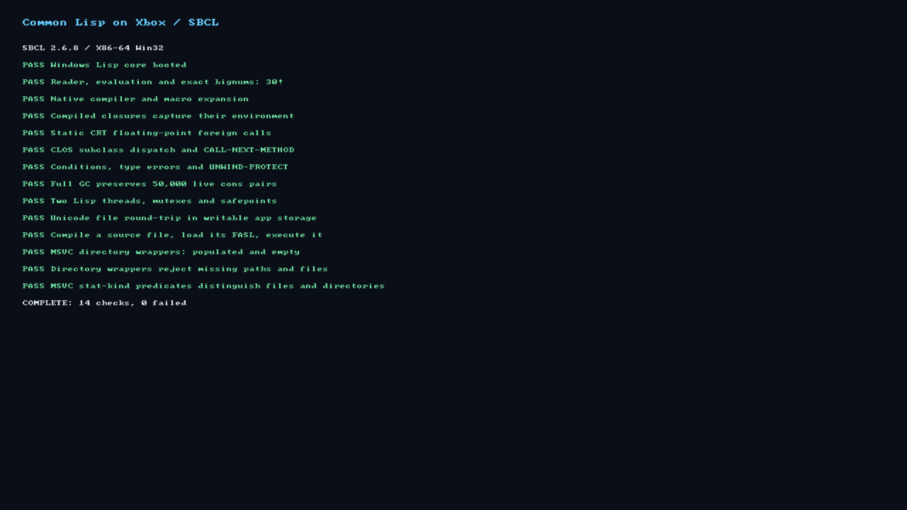

# Common Lisp on Xbox: SBCL probe

This app embeds a real SBCL 2.6.8 runtime and Lisp core, cross-built through
`pkgsXbox`. It runs Lisp checks on a CRT thread while SDL keeps the UWP view
responsive. This is a Developer Mode experiment, not a supported Store port.

```sh
./build sbcl-probe
export UWP_DEVICE_URL=https://xbox.whale-justice.ts.net
nix run .#deploy-sbcl-probe -- --screenshot build-output/sbcl.png --crash-dumps

# Runtime/core alone; its build runs the same Lisp checks under Wine.
nix build .#sbcl-runtime -L
```

These targets need a Linux build host with Wine. No runtime configuration,
credentials or network service is needed by the app.

## Checks and reports

The app displays the report from `LocalState/nixbox/sbcl-probe/lisp.txt`.
`startup.txt` records WinMain, SDL activation and renderer/worker startup;
`runtime.txt` captures SBCL's standard output/error. Each Lisp check is flushed
before and after execution. Only `COMPLETE: 14 checks, 0 failed` establishes
success; installation, activation or a running process does not. The old report
is cleared before starting Lisp so a failed relaunch cannot show stale passes.

The checks exercise exact bignums and evaluation, macro expansion and native
compilation, closures, CRT math, CLOS dispatch, conditions and unwinding,
retained objects across full GC, two threads/mutexes/safepoints, Unicode file
I/O, source compilation/FASL loading, and MSVC directory/stat wrappers with
populated, empty, missing and not-directory cases.

## Build and boundaries

The [runtime recipe](../../nix/experiments/sbcl-cross.nix) uses a native bootstrap
SBCL, target Win32 helpers under Wine, and a native perfecthash generator.
Both cold and warm initialization complete. The target runtime and SDL host
share the static Microsoft CRT; runtime/CRT exports provide Lisp's foreign
symbols without loading a second CRT with separate file-descriptor/errno tables.
The package includes SBCL's COPYING/CREDITS and the TLSF allocator's BSD license
under `sbcl-notices/`.

The GUI link emits exact exports in a C object's linker directives. Passing the
same names through a `.def` file in the C++ link allowed LLD's fuzzy matching
to select long-double math wrappers, producing self-jumps during CRT startup.
A live Xbox dump confirmed that instruction address. A build-time export check
rejects the actual failing executable and passes the corrected one.

The host reopens all three CRT streams: Xbox starts stdin/stderr at descriptor
−2, so duplicating into an unopened stderr fails. On Windows, directory creation
starts at the deepest existing directory rather than probing inaccessible
sandbox ancestors such as `Q:\Users`. A Wine regression with a hidden ancestor
failed with the old core and passed with the adaptation; the Unix path is unchanged.

Adaptations remain local to SBCL: MSVC headers, directory/stat wrappers,
exception-context spelling, PE exports, Unicode host argument injection, and
deliberate desktop memory/exception imports. The shared UWP toolchain and SDK
family are unchanged. AVX-512 is disabled for the Xbox CPU. Compression,
mark-region GC, packaged contrib/ASDF and an interactive REPL are not included.

The [earlier platform probe](../sbcl-platform/README.md) established real Xbox
RWX allocation/code execution, exception recovery and thread primitives, but
is not a substitute for this app's Lisp results. Wine passes likewise do not
establish Xbox policy compatibility or suspend/resume/long-term reliability.

## Xbox result (2026-10-05)

The exact directory-corrected package was hash-verified and run on a real Xbox
Series X through the tailnet-connected Linux runner. Its LocalState report ends
with **`COMPLETE: 14 checks, 0 failed`**. The Nix build's Wine run reports the same
result, and the linked executable passes the export check and packaging audit.

A relaunch produced a byte-identical Lisp report. Its process remained running
through all 65 monitoring samples, ending at 66.17 seconds; screenshots at five
and 65 seconds showed all 14 passes and no stopped-runtime UI. No new crash dump
or WER report was observed. Another app replaced it after that observation
window, so this is not a claim of indefinite liveness or current foreground state.



The hardware-tested package's SHA256 is
`f0599fc95999755fa3b330d2b6e17c488fd5fb3f97b9bc058f92d84991cdf180`.
A final rebuild adding the TLSF license has SHA256
`c8baa1a79cf02a6db2378b86f87d8e5cf6a5335bc20652804cbd9a12a53a04d9`.
Its executable and probe script are byte-identical to the tested package, but
its regenerated core differs. That build passes all 14 Wine checks; its separate
Xbox deployment attempt was blocked before installation by HTTP 409, "Another
deployment is running." No old report or screenshot is claimed as validation
of that final package.

Earlier checkpoints exposed the recursive CRT export, unopened stdio descriptors
and inaccessible directory ancestors above. None of those failures was hidden
or excluded from the checks. The console is shared with another foreground app;
foreground replacement is not evidence of a Lisp crash. These results do not
establish long-term reliability or suspend/resume support.
